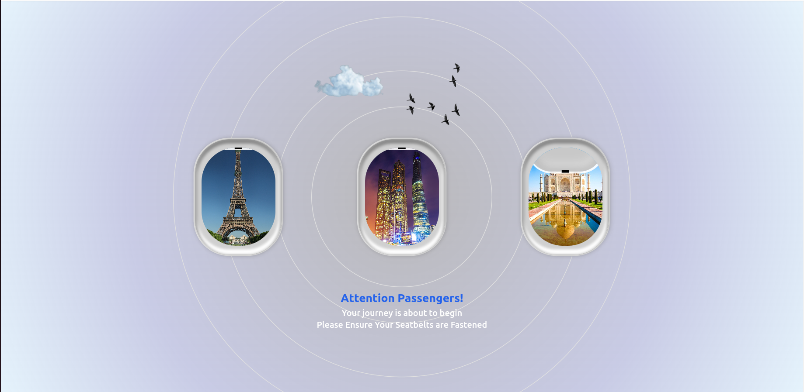
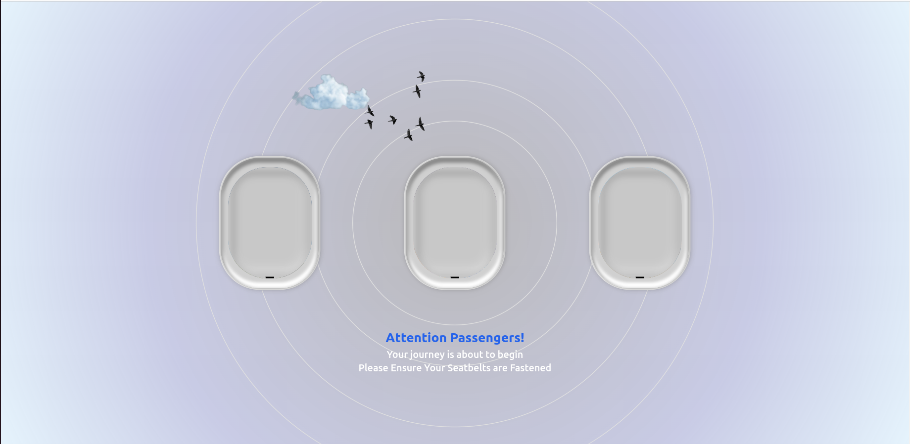
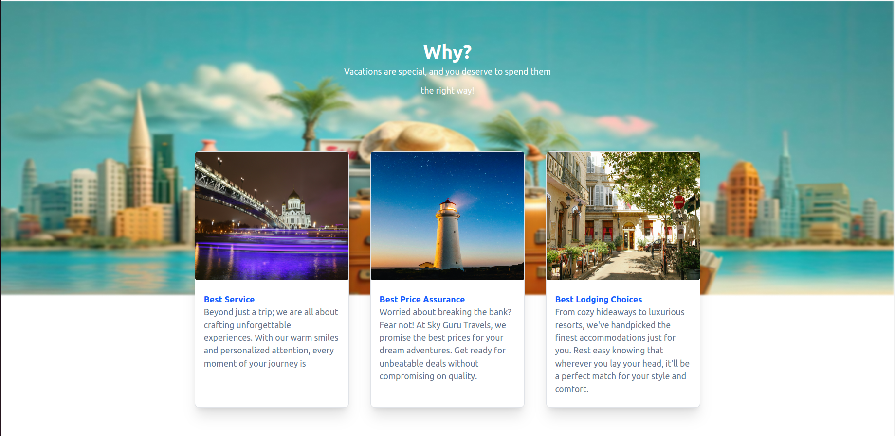

## 🌐 demo link: [Live Demo](https://parallax-ui.vercel.app/)

# 🪟 Scrolling Window Animation

 

This project showcases a smooth scrolling animation effect with three windows that open to reveal different images. The project is built using modern web technologies, including Svelte, GSAP, and Tailwind CSS.

## 🚀 Tech Used

-  HTML
-  CSS
-  JavaScript
-  Svelte
-  GSAP (GreenSock Animation Platform)
-  Tailwind CSS

## 📋 Prerequisites

-  Node.js (version 12.0.0 or higher)
-  npm (usually comes with Node.js)

## 🛠️ Installation

1. ## 1. **Clone this repository** or download the source code:

   ```bash
   git clone https://github.com/vivek20Eng/Parallax-UI.git
2. ## 2. **Navigate to the project** directory in your terminal:
    ```bash
    cd Parallax-UI
3. ## 3. Install the required dependencies:
    ```bash 
    npm install
4. ## 4. Running the Project
    ```bash
    npm run dev
5. ## 5. Open your web browser and go to 
    ```bash
    http://localhost:5173/


## 🖼️ Screenshots

 
 
 
 
